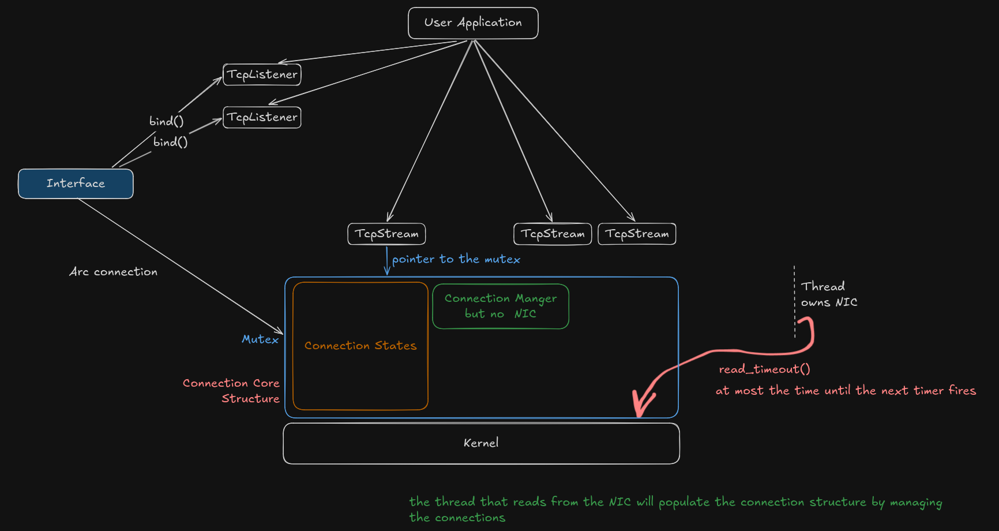

# BareTCP

A TCP/IP stack implemented from scratch in Rust, running entirely in userspace on top of a TUN device — no kernel TCP involved.

> 🚧 **Status:** Personal, ambitious, work-in-progress project. Currently a single-threaded prototype that reads raw IP packets off a TUN interface, parses TCP headers, and manages per-connection state. Architecture (see diagram below) is exploratory and might change might not idk.



## What it does right now

- Creates a `tun0` device and reads raw Ethernet/IP frames directly off it
- Filters for IPv4 + TCP, parses headers with `etherparse`
- Tracks each connection by its 4-tuple (src ip/port, dst ip/port) and routes packets to a per-connection state machine (`tcp/connection.rs`, `state.rs`, `send.rs`, `recv.rs`)
- Handles sequence numbers / ISN generation (`util/seq.rs`, `util/isn.rs`)

## Planned direction

The current rough idea (subject to heavy change) is to move from a single-threaded loop to something closer to:

- `TcpListener`/`TcpStream` style handles for user applications, backed by an `Interface` that owns the TUN device
- Connection state shared via `Arc<Mutex<...>>` between the application-facing handles and the thread that actually owns the NIC
- That NIC-owning thread reads packets and updates connection state for everyone, using something like `read_timeout()` to bound how long it blocks between servicing timers/retransmits

This isn't implemented yet — it's a sketch of where the project is headed, not how it works today.

## Stack

- Rust (edition 2024)
- [`tun-tap`](https://crates.io/crates/tun-tap) — TUN device creation/IO
- [`etherparse`](https://crates.io/crates/etherparse) — IP/TCP header parsing

## Running

```bash
./run.sh
```

This builds in release mode, grants the binary `CAP_NET_ADMIN` (so it can manage the TUN device without running fully as root), brings up `tun0` with address `10.200.0.1/24`, and runs the stack.

## Why

To actually understand TCP (handshakes, sequence numbers, yada yada yada) to have **FUN** by implementing it rather than reading about it.

## Credits

A lot of the foundation here comes from following [Jon Gjengset's](https://github.com/jonhoo) TCP-from-scratch series on [YouTube](https://www.youtube.com/@jonhoo). Huge thanks to him — his videos taught me most of what I know going into this.
